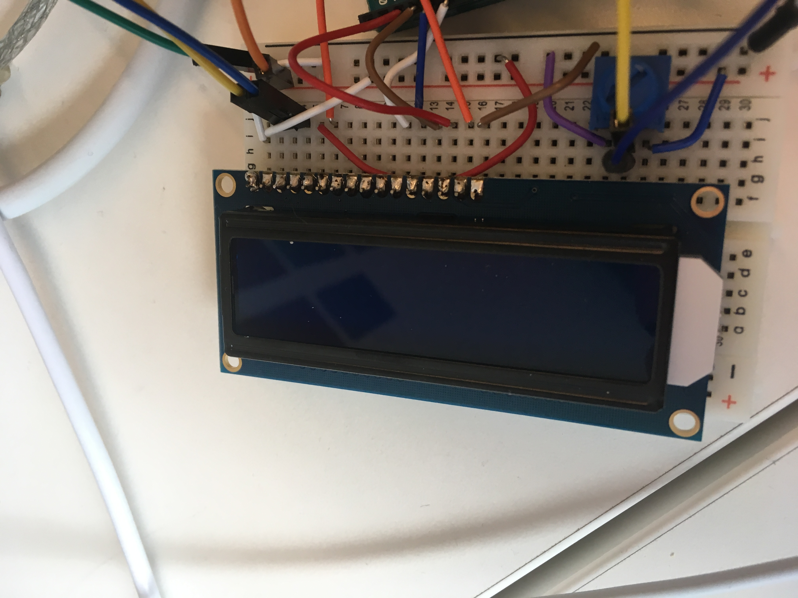

# Make a Digital Timer!
 
## Overview
For this assignment, you are going to 

A) [Solder your LCD panel](#part-a-solder-your-lcd-panel)

B) [Write text to an LCD Panel](#part-b-writing-to-the-lcd) 

c) [Using a time-based digital sensor!](#part-c-using-a-time-based-digital-sensor)

D) [Make your Arduino sing!](#part-d-make-your-arduino-sing)

E) [Make your own timer](#part-e-make-your-own-timer) 
 

## Part A. Solder your LCD panel

**Take a picture of your soldered panel and add it here!**

## Part B. Writing to the LCD
 
**a. What voltage level do you need to power your display?**
3.3 V, you can tell by unplugging the wire that attaches to 3.3, and see what turns off. Same with the backlight.
**b. What voltage level do you need to power the display backlight?**
  5 V
**c. What was one mistake you made when wiring up the display? How did you fix it?**

I didn't understand that the numbers on the breadboard didn't correspond to those on ground and +. I forgot to connect certain wires for this reason. To fix it, I added wires. 

**d. What line of code do you need to change to make it flash your name instead of "Hello World"?**

lcd.print("hello, world!")
to
lcd.pring("Natalie")

But it isn't flashing...

**e. Include a copy of your Lowly Multimeter code in your lab write-up.**

https://www.arduino.cc/en/Tutorial/HelloWorld
Justin helped me with this:

void loop() {
  voltageValue = analogRead(A0);
  realVoltage = (voltageValue * 5.0) / 1024.0;
  
  // set the cursor to column 0, line 1
  // (note: line 1 is the second row, since counting begins with 0):
  lcd.setCursor(0, 1);
  // print the number of seconds since reset:
  // lcd.print(millis() / 1000);
  lcd.print(realVoltage);
}

## Part C. Using a time-based digital sensor

**Upload a video of your working rotary encoder here.**

to see the display, make sure the baud matches in the code and the serial monitor.
Also, make sure at the top of the code...

#define ENC_A 7 //these need to be digital input pins
#define ENC_B 8

...That the numbers match where your pins are.

## Part D. Make your Arduino sing!

**a. How would you change the code to make the song play twice as fast?**
 
**b. What song is playing?**

## Part E. Make your own timer

**a. Make a short video showing how your timer works, and what happens when time is up!**

**b. Post a link to the completed lab report your class hub GitHub repo.**
